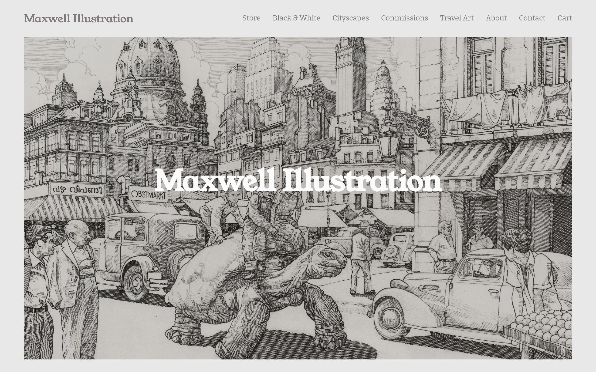

# maxwellillustration Design System

You are building UI for **maxwellillustration**. Dark-themed, warm palette, serif typography (Bitter), compact density on a 4px grid, expressive motion.

## Visual Reference

**IMPORTANT**: Study ALL screenshots below before writing any UI. Match colors, typography, spacing, layout, and motion exactly as shown.

### Homepage



> Read `references/DESIGN.md` for full token details.

## Design Philosophy

- **Layered depth** — use shadow tokens to create a sense of physical layering. Each elevation level has a specific shadow.
- **Gradient accents** — gradients are used thoughtfully for emphasis, not decoration.
- **Type pairing** — Bitter for body/UI text, Young Serif for headings/display. Never introduce a third typeface.
- **compact density** — 4px base grid. Every dimension is a multiple of 4.
- **warm palette** — the color temperature runs warm, matching the serif typography.
- **Restrained accent** — `#7dbb00` is the only pop of color. Used exclusively for CTAs, links, focus rings, and active states.
- **Expressive motion** — animations are an integral part of the experience. Use spring physics and layout animations.

## Color System

### Core Palette

| Role | Token | Hex | Use |
|------|-------|-----|-----|
| Background | `--background` | `#000000` | Page/app background |
| Surface | `--surface` | `#272727` | Cards, panels, modals |
| Text Primary | `--text-primary` | `#ffffff` | Headings, body text |
| Text Muted | `--text-muted` | `#666666` | Captions, placeholders |
| Accent | `--accent` | `#7dbb00` | CTAs, links, focus rings |
| Border | `--border` | `#3e3e3e` | Dividers, card borders |

### Status Colors

| Status | Hex | Use |
|--------|-----|-----|
| Danger | `#f0523d` | Errors, destructive actions |

### Extended Palette

- `#eeeeee` — Light surface or highlight color
- `#333333`
- `#111111` — Deep background layer or shadow color
- `#c4c4c4`
- `#dddddd`
- `#999999`
- **social-icon-color:** `#0063dc`
- `#aaaaaa`

### CSS Variable Tokens

```css
--safeLightAccent-hsl: 45,7.69%,79.61%;
--safeDarkAccent-hsl: 0,6.12%,19.22%;
--safeInverseAccent-hsl: 0,6.12%,19.22%;
--safeInverseLightAccent-hsl: 0,6.12%,19.22%;
--safeInverseDarkAccent-hsl: 0,0%,98.43%;
--accent-hsl: 45,7.69%,79.61%;
--lightAccent-hsl: 0,0%,90.98%;
--darkAccent-hsl: 0,2.79%,49.22%;
--tweak-summary-block-read-more-color-on-background: hsla(var(--black-hsl),1);
--tweak-quote-block-source-color-on-background: hsla(var(--black-hsl),1);
--list-section-simple-button-background-color: hsla(var(--safeDarkAccent-hsl),1);
--gradientHeaderBorderColor: hsla(var(--black-hsl),1);
--tweak-summary-block-header-text-color-on-background: hsla(var(--black-hsl),1);
--tweak-summary-block-background-color: hsla(var(--lightAccent-hsl),1);
--list-section-carousel-card-description-color: hsla(var(--black-hsl),1);
--scheduling-block-scheduler-background-color: hsla(var(--white-hsl),1);
--image-block-card-inline-link-color: hsla(var(--black-hsl),1);
--tweak-summary-block-primary-metadata-color-on-background: hsla(var(--black-hsl),1);
--list-section-banner-slideshow-card-description-link-color: hsla(var(--safeDarkAccent-hsl),1);
--tweak-paragraph-medium-color-on-background: hsla(var(--black-hsl),1);
```

## Typography

### Font Stack

- **Bitter** — Heading 1, Heading 2, Heading 3
- **Young Serif** — Body, Caption

### Font Sources

```css
@font-face {
  font-family: "Bitter";
  src: url("fonts/Bitter-Bold.ttf") format("truetype");
  font-weight: 700;
}
@font-face {
  font-family: "Bitter";
  src: url("fonts/Bitter-Regular.ttf") format("truetype");
  font-weight: 400;
}
@font-face {
  font-family: "Young Serif";
  src: url("fonts/YoungSerif-Regular.ttf") format("truetype");
  font-weight: 400;
}
@font-face {
  font-family: "squarespace-ui-font";
  src: url("fonts/squarespace-ui-font-Regular.woff") format("woff");
  font-weight: 400;
}
@font-face {
  font-family: "social-icon-font";
  src: url("fonts/social-icon-font-Regular.woff") format("woff");
  font-weight: 400;
}
```

### Type Scale

| Role | Family | Size | Weight |
|------|--------|------|--------|
| Heading 1 | Bitter | calc((var(--primary-button-font-font-size-value) - 1)*calc(.012*min(100vh,900px)) + 1rem) | 700 |
| Heading 2 | Bitter | calc((var(--secondary-button-font-font-size-value) - 1)*calc(.012*min(100vh,900px)) + 1rem) | 700 |
| Heading 3 | Bitter | calc((var(--tertiary-button-font-font-size-value) - 1)*calc(.012*min(100vh,900px)) + 1rem) | 700 |
| Body | Young Serif | 12px | 400 |
| Caption | Young Serif | 14px | 400 |

### Typography Rules

- Body/UI: **Bitter**, Headings: **Young Serif** — these are the only display fonts
- Max 3-4 font sizes per screen
- Headings: weight 600-700, body: weight 400
- Use color and opacity for text hierarchy, not additional font sizes
- Line height: 1.5 for body, 1.2 for headings

## Spacing & Layout

### Base Grid: 4px

Every dimension (margin, padding, gap, width, height) must be a multiple of **4px**.

### Spacing Scale

`2, 4, 6, 8, 10, 12, 14, 16, 18, 20, 22, 24` px

### Spacing as Meaning

| Spacing | Use |
|---------|-----|
| 4-8px | Tight: related items (icon + label, avatar + name) |
| 12-16px | Medium: between groups within a section |
| 24-32px | Wide: between distinct sections |
| 48px+ | Vast: major page section breaks |

### Border Radius

Scale: `.15em, .4em, .4rem, 1px, 1em, 2px, 3px, 3em, 4px, 5px, 8px, 10px, 14px, 15%, 18px, 25%, 25px, 30px, 41px, 50px, 100%, 100px, 150px, 300px, 500px, 1000px, calc(13px*2), inherit`
Default: `18px`

### Container

Max-width: `1280px`, centered with auto margins.

### Breakpoints

| Name | Value |
|------|-------|
| xs | 320px |
| xs | 400px |
| xs | 414px |
| xs | 430px |
| xs | 432px |
| xs | 433px |
| xs | 480px |
| sm | 575px |
| sm | 576px |
| sm | 600px |
| sm | 639px |
| sm | 640px |
| md | 650px |
| md | 700px |
| md | 767px |
| md | 768px |
| lg | 769px |
| lg | 799px |
| lg | 800px |
| lg | 991px |
| lg | 992px |
| lg | 1024px |
| xl | 1025px |
| xl | 1099px |
| xl | 1100px |
| xl | 1199px |
| xl | 1200px |
| xl | 1280px |
| 2xl | 1281px |
| 2xl | 1512px |

Mobile-first: design for small screens, layer on responsive overrides.

## Component Patterns

### Card

```css
.card {
  background: #272727;
  border: 1px solid #3e3e3e;
  border-radius: 18px;
  padding: 16px;
  box-shadow: -2px 1px 6px 1px rgba(0,0,0,.1);
}
```

```html
<div class="card">
  <h3>Card Title</h3>
  <p>Card content goes here.</p>
</div>
```

### Button

```css
/* Primary */
.btn-primary {
  background: #7dbb00;
  color: #ffffff;
  border-radius: 18px;
  padding: 8px 16px;
  font-weight: 500;
  transition: opacity 150ms ease;
}
.btn-primary:hover { opacity: 0.9; }

/* Ghost */
.btn-ghost {
  background: transparent;
  border: 1px solid #3e3e3e;
  color: #ffffff;
  border-radius: 18px;
  padding: 8px 16px;
}
```

```html
<button class="btn-primary">Get Started</button>
<button class="btn-ghost">Learn More</button>
```

### Input

```css
.input {
  background: #000000;
  border: 1px solid #3e3e3e;
  border-radius: 18px;
  padding: 8px 12px;
  color: #ffffff;
  font-size: 14px;
}
.input:focus { border-color: #7dbb00; outline: none; }
```

```html
<input class="input" type="text" placeholder="Search..." />
```

### Badge / Chip

```css
.badge {
  display: inline-flex;
  align-items: center;
  padding: 4px 8px;
  border-radius: 9999px;
  font-size: 12px;
  font-weight: 500;
  background: #272727;
  color: #666666;
}
```

```html
<span class="badge">New</span>
<span class="badge">Beta</span>
```

### Modal / Dialog

```css
.modal-backdrop { background: rgba(0, 0, 0, 0.6); }
.modal {
  background: #272727;
  border: 1px solid #3e3e3e;
  border-radius: inherit;
  padding: 24px;
  max-width: 480px;
  width: 90vw;
  box-shadow: 0 0 10px rgba(0,0,0,.15);
}
```

```html
<div class="modal-backdrop">
  <div class="modal">
    <h2>Dialog Title</h2>
    <p>Dialog content.</p>
    <button class="btn-primary">Confirm</button>
    <button class="btn-ghost">Cancel</button>
  </div>
</div>
```

### Table

```css
.table { width: 100%; border-collapse: collapse; }
.table th {
  text-align: left;
  padding: 8px 12px;
  font-weight: 500;
  font-size: 12px;
  color: #666666;
  text-transform: uppercase;
  letter-spacing: 0.05em;
  border-bottom: 1px solid #3e3e3e;
}
.table td {
  padding: 12px;
  border-bottom: 1px solid #3e3e3e;
}
```

```html
<table class="table">
  <thead><tr><th>Name</th><th>Status</th><th>Date</th></tr></thead>
  <tbody>
    <tr><td>Item One</td><td>Active</td><td>Jan 1</td></tr>
    <tr><td>Item Two</td><td>Pending</td><td>Jan 2</td></tr>
  </tbody>
</table>
```

### Navigation

```css
.nav {
  display: flex;
  align-items: center;
  gap: 8px;
  padding: 12px 16px;
  border-bottom: 1px solid #3e3e3e;
}
.nav-link {
  color: #666666;
  padding: 8px 12px;
  border-radius: 18px;
  transition: color 150ms;
}
.nav-link:hover { color: #ffffff; }
.nav-link.active { color: #7dbb00; }
```

```html
<nav class="nav">
  <a href="/" class="nav-link active">Home</a>
  <a href="/about" class="nav-link">About</a>
  <a href="/pricing" class="nav-link">Pricing</a>
  <button class="btn-primary" style="margin-left: auto">Get Started</button>
</nav>
```

### Extracted Components

These components were found in the codebase:

**Button** (`html`)

**Card** (`html`)
- Variants: `text-alignment-left`

**Navigation** (`html`)

**Badge** (`html`)

**Modal** (`html`)

**List** (`html`)

## Page Structure

The following page sections were detected:

- **Navigation** — Top navigation bar (7 items)
- **Hero** — Hero section (detected from heading structure)
- **Footer** — Page footer with links and info (1 items)

When building pages, follow this section order and structure.

## Animation & Motion

This project uses **expressive motion**. Animations are part of the design language.

### CSS Animations

- `bounceIn`
- `bounceOut`
- `shiver`
- `shimmy`
- `spin`

### Motion Tokens

- **Duration scale:** `0s`, `0ms`, `.1s`, `.2s`, `.3s`, `1s`, `1ms`, `1.6s`, `2s`, `4s`, `50ms`, `100ms`, `140ms`, `150ms`, `170ms`, `200ms`, `250ms`, `300ms`, `350ms`, `400ms`, `450ms`, `500ms`, `600ms`, `750ms`, `800ms`, `1000ms`
- **Easing functions:** `ease-in`, `cubic-bezier(.175,.885,.32,1.275)`, `linear`, `ease-in-out`, `ease-out`, `ease`, `cubic-bezier(.25,.46,.45,.94)`, `cubic-bezier(.4,0,.2,1)`, `cubic-bezier(.19,1,.22,1)`, `cubic-bezier(.2,.6,.3,1)`, `cubic-bezier(0,0,.2,1)`, `cubic-bezier(.33,1,.68,1)`, `cubic-bezier(.25,1,.6,1)`, `cubic-bezier(.5,0,1,.5)`, `cubic-bezier(.61,1,.88,1)`, `cubic-bezier(.25,.1,.25,1)`, `cubic-bezier(.66,0,.34,1)`
- **Animated properties:** `background`

### Motion Guidelines

- **Duration:** Use values from the duration scale above. Short (0s) for micro-interactions, long (1000ms) for page transitions
- **Easing:** Use `ease-in` as the default easing curve
- **Direction:** Elements enter from bottom/right, exit to top/left
- **Reduced motion:** Always respect `prefers-reduced-motion` — disable animations when set

## Depth & Elevation

### Shadow Tokens

- Subtle: `0 0 0 1px rgba(0,0,0,.086),0 1px rgba(0,0,0,.15)`
- Subtle: `0 1px 1px rgba(0,0,0,.3)`
- Subtle: `0px 0px 0px 2px var(--solidHeaderNavigationColor) inset`
- Subtle: `0px 0px 0px 2px var(--gradientHeaderNavigationColor) inset`
- Subtle: `0 1px 2px rgba(0,0,0,.15)`
- Subtle: `0 1px 0#fff`

### Z-Index Scale

`0, 1, 2, 3, 4, 5, 6, 7, 8, 9, 10, 50, 99, 100, 200, 999, 1000, 1001, 9000, 9999, 10000, 15000, 20000, 20001, 30100, 300000, 999999, 1000000, 10000000, 100000000, 100000001, 100000002, 999999999999, 9999999999999`

Use these exact values — never invent z-index values.

## Anti-Patterns (Never Do)

- **No blur effects** — no backdrop-blur, no filter: blur()
- **No zebra striping** — tables and lists use borders for separation
- **No invented colors** — every hex value must come from the palette above
- **No arbitrary spacing** — every dimension is a multiple of 4px
- **No extra fonts** — only Bitter and Young Serif are allowed
- **No arbitrary border-radius** — use the scale: .15em, .4em, .4rem, 1px, 1em, 2px, 3px, 3em, 4px, 5px
- **No opacity for disabled states** — use muted colors instead

## Workflow

1. **Read** `references/DESIGN.md` before writing any UI code
2. **Pick colors** from the Color System section — never invent new ones
3. **Set typography** — Bitter, Young Serif only, using the type scale
4. **Build layout** on the 4px grid — check every margin, padding, gap
5. **Match components** to patterns above before creating new ones
6. **Apply elevation** — use shadow tokens
7. **Validate** — every value traces back to a design token. No magic numbers.

## Brand Spec

- **Favicon:** `https://assets.squarespace.com/universal/default-favicon.ico`
- **Site URL:** `https://www.maxwellillustration.uk`
- **Brand color:** `#7dbb00`
- **Brand typeface:** Bitter

## Quick Reference

```
Background:     #000000
Surface:        #272727
Text:           #ffffff / #666666
Accent:         #7dbb00
Border:         #3e3e3e
Font:           Bitter
Spacing:        4px grid
Radius:         18px
Components:     11 detected
```

## When to Trigger

Activate this skill when:
- Creating new components, pages, or visual elements for maxwellillustration
- Writing CSS, Tailwind classes, styled-components, or inline styles
- Building page layouts, templates, or responsive designs
- Reviewing UI code for design consistency
- The user mentions "maxwellillustration" design, style, UI, or theme
- Generating mockups, wireframes, or visual prototypes

---

# Full Reference Files

> Every output file is embedded below. Claude has full design system context from /skills alone.

## Design System Tokens (DESIGN.md)

# maxwellillustration DESIGN.md

> Auto-generated design system — reverse-engineered via static analysis by skillui.
> Frameworks: None detected
> Colors: 20 · Fonts: 2 · Components: 11
> Icon library: not detected · State: not detected
> Primary theme: dark · Dark mode toggle: no · Motion: expressive

## Visual Reference

**Match this design exactly** — study colors, fonts, spacing, and component shapes before writing any UI code.


---

## 1. Visual Theme & Atmosphere

This is a **dark-themed** interface with a warm tone. Depth is expressed through layered shadows and subtle surface color variation. Typography pairs **Young Serif** for display/headings with **Bitter** for body text, creating clear visual hierarchy through type contrast. Spacing follows a **4px base grid** (compact density), with scale: 2, 4, 6, 8, 10, 12, 14, 16px. The palette is predominantly monochromatic with **#7dbb00** as the single accent color — used sparingly for interactive elements and emphasis. Motion is expressive — spring physics, layout animations, and staggered reveals are part of the visual language.

---

## 2. Color Palette & Roles

| Token | Hex | Role | Use |
|---|---|---|---|
| social-icon-color | `#000000` | background | Page background, darkest surface |
| social-icons-color | `#272727` | surface | Card and panel backgrounds |
| social-icons-color | `#ffffff` | text-primary | Headings and body text |
| text-muted | `#666666` | text-muted | Captions, placeholders, secondary info |
| border | `#3e3e3e` | border | Dividers, card borders, outlines |
| social-icon-color | `#7dbb00` | accent | CTAs, links, focus rings, active states |
| danger | `#f0523d` | danger | Error states, destructive actions |
| social-icon-color | `#0063dc` | info | Informational highlights |
| unknown | `#eeeeee` | unknown | Palette color |
| unknown | `#333333` | unknown | Palette color |
| unknown | `#111111` | unknown | Palette color |
| unknown | `#c4c4c4` | unknown | Palette color |
| unknown | `#dddddd` | unknown | Palette color |
| unknown | `#999999` | unknown | Palette color |
| unknown | `#aaaaaa` | unknown | Palette color |
| social-icon-color | `#cc2127` | unknown | Palette color |
| social-icon-color | `#e52d27` | unknown | Palette color |
| unknown | `#b4b4b4` | unknown | Palette color |
| unknown | `#4a5464` | unknown | Palette color |
| unknown | `#00b2ff` | unknown | Palette color |

### CSS Variable Tokens

```css
--safeLightAccent-hsl: 45,7.69%,79.61%;
--safeDarkAccent-hsl: 0,6.12%,19.22%;
--safeInverseAccent-hsl: 0,6.12%,19.22%;
--safeInverseLightAccent-hsl: 0,6.12%,19.22%;
--safeInverseDarkAccent-hsl: 0,0%,98.43%;
--accent-hsl: 45,7.69%,79.61%;
--lightAccent-hsl: 0,0%,90.98%;
--darkAccent-hsl: 0,2.79%,49.22%;
--tweak-summary-block-read-more-color-on-background: hsla(var(--black-hsl),1);
--tweak-quote-block-source-color-on-background: hsla(var(--black-hsl),1);
--list-section-simple-button-background-color: hsla(var(--safeDarkAccent-hsl),1);
--gradientHeaderBorderColor: hsla(var(--black-hsl),1);
--tweak-summary-block-header-text-color-on-background: hsla(var(--black-hsl),1);
--tweak-summary-block-background-color: hsla(var(--lightAccent-hsl),1);
--list-section-carousel-card-description-color: hsla(var(--black-hsl),1);
--scheduling-block-scheduler-background-color: hsla(var(--white-hsl),1);
--image-block-card-inline-link-color: hsla(var(--black-hsl),1);
--tweak-summary-block-primary-metadata-color-on-background: hsla(var(--black-hsl),1);
--list-section-banner-slideshow-card-description-link-color: hsla(var(--safeDarkAccent-hsl),1);
--tweak-paragraph-medium-color-on-background: hsla(var(--black-hsl),1);
```


---

## 3. Typography Rules

**Font Stack:**
- **Bitter** — Heading 1, Heading 2, Heading 3
- **Young Serif** — Body, Caption

**Font Sources:**

```css
@font-face {
  font-family: "Bitter";
  src: url("fonts/Bitter-Bold.ttf") format("truetype");
  font-weight: 700;
}
@font-face {
  font-family: "Bitter";
  src: url("fonts/Bitter-Regular.ttf") format("truetype");
  font-weight: 400;
}
@font-face {
  font-family: "Young Serif";
  src: url("fonts/YoungSerif-Regular.ttf") format("truetype");
  font-weight: 400;
}
@font-face {
  font-family: "squarespace-ui-font";
  src: url("fonts/squarespace-ui-font-Regular.woff") format("woff");
  font-weight: 400;
}
@font-face {
  font-family: "social-icon-font";
  src: url("fonts/social-icon-font-Regular.woff") format("woff");
  font-weight: 400;
}
```

| Role | Font | Size | Weight |
|---|---|---|---|
| Heading 1 | Bitter | calc((var(--primary-button-font-font-size-value) - 1)*calc(.012*min(100vh,900px)) + 1rem) | 700 |
| Heading 2 | Bitter | calc((var(--secondary-button-font-font-size-value) - 1)*calc(.012*min(100vh,900px)) + 1rem) | 700 |
| Heading 3 | Bitter | calc((var(--tertiary-button-font-font-size-value) - 1)*calc(.012*min(100vh,900px)) + 1rem) | 700 |
| Body | Young Serif | 12px | 400 |
| Caption | Young Serif | 14px | 400 |

**Typographic Rules:**
- Limit to 2 font families max per screen
- Use **Bitter** for body/UI text, **Young Serif** for display/headings
- Maintain consistent hierarchy: no more than 3-4 font sizes per screen
- Headings use bold (600-700), body uses regular (400)
- Line height: 1.5 for body text, 1.2 for headings
- Use color and opacity for secondary hierarchy, not additional font sizes


---

## 4. Component Stylings

### Layout (1)

**Footer** — `html`

### Navigation (1)

**Navigation** — `html`

### Data Display (3)

**Card** — `html`
- Variants: `text-alignment-left`

**Badge** — `html`

**List** — `html`

### Data Input (2)

**Button** — `html`
- Animation: 

**Input** — `html`
- State: :focus, :placeholder

### Overlay (1)

**Modal** — `html`

### Media (3)

**Image** — `html`

**Icon** — `html`

**Map/Canvas** — `html`


---

## 5. Layout Principles

- **Base spacing unit:** 4px
- **Spacing scale:** 2, 4, 6, 8, 10, 12, 14, 16, 18, 20, 22, 24
- **Border radius:** .15em, .4em, .4rem, 1px, 1em, 2px, 3px, 3em, 4px, 5px, 8px, 10px, 14px, 15%, 18px, 25%, 25px, 30px, 41px, 50px, 100%, 100px, 150px, 300px, 500px, 1000px, calc(13px*2), inherit
- **Max content width:** 1280px

**Spacing as Meaning:**
| Spacing | Use |
|---|---|
| 4-8px | Tight: related items within a group |
| 12-16px | Medium: between groups |
| 24-32px | Wide: between sections |
| 48px+ | Vast: major section breaks |


---

## 6. Depth & Elevation

### Flat — subtle depth hints

- `0 0 0 1px rgba(0,0,0,.086),0 1px rgba(0,0,0,.15)`
- `0 1px 1px rgba(0,0,0,.3)`
- `0px 0px 0px 2px var(--solidHeaderNavigationColor) inset`

### Raised — cards, buttons, interactive elements

- `-2px 1px 6px 1px rgba(0,0,0,.1)`
- `#000 0em 0em 0em`
- `#ddd 1px -1px 5px`

### Floating — dropdowns, popovers, modals

- `0 0 10px rgba(0,0,0,.15)`
- `0 0 10px rgba(0,0,0,.2)`

### Overlay — full-screen overlays, top-level dialogs

- `0 4px 33px rgba(0,0,0,.22),0 0 0 1px rgba(0,0,0,.04)`
- `0px -20px 110px #000`

### Z-Index Scale

`0, 1, 2, 3, 4, 5, 6, 7, 8, 9, 10, 50, 99, 100, 200, 999, 1000, 1001, 9000, 9999, 10000, 15000, 20000, 20001, 30100, 300000, 999999, 1000000, 10000000, 100000000, 100000001, 100000002, 999999999999, 9999999999999`


---

## 7. Animation & Motion

This project uses **expressive motion**. Animations are an integral part of the experience.

### CSS Animations

- `@keyframes bounceIn`
- `@keyframes bounceOut`
- `@keyframes shiver`
- `@keyframes shimmy`
- `@keyframes spin`
- `@keyframes pulseBadgeOpacity`
- `@keyframes fadeout`
- `@keyframes riseandfadein`

### Animated Components

- **Button**: 

### Motion Guidelines

- Duration: 150-300ms for micro-interactions, 300-500ms for page transitions
- Easing: `ease-out` for enters, `ease-in` for exits
- Always respect `prefers-reduced-motion`


---

## 8. Do's and Don'ts

### Do's

- Use `#7dbb00` for interactive elements (buttons, links, focus rings)
- Use `#000000` as the primary page background
- Pair **Bitter** (body) with **Young Serif** (display) — these are the only allowed fonts
- Follow the **4px** spacing grid for all margins, padding, and gaps
- Use the defined shadow tokens for elevation — see Section 6
- Use border-radius from the scale: .15em, .4em, .4rem, 1px, 1em
- Reuse existing components from Section 4 before creating new ones

### Don'ts

- Don't introduce colors outside this palette — extend the design tokens first
- Don't introduce additional font families beyond Bitter and Young Serif
- Don't use arbitrary spacing values — stick to multiples of 4px
- Don't create custom box-shadow values outside the system tokens
- Don't use arbitrary border-radius values — pick from the defined scale
- Don't duplicate component patterns — check Section 4 first
- Don't use backdrop-blur or blur effects

### Anti-Patterns (detected from codebase)

- No blur or backdrop-blur effects
- No zebra striping on tables/lists


---

## 9. Responsive Behavior

| Name | Value | Source |
|---|---|---|
| xs | 320px | css |
| xs | 400px | css |
| xs | 414px | css |
| xs | 430px | css |
| xs | 432px | css |
| xs | 433px | css |
| xs | 480px | css |
| sm | 575px | css |
| sm | 576px | css |
| sm | 600px | css |
| sm | 639px | css |
| sm | 640px | css |
| md | 650px | css |
| md | 700px | css |
| md | 767px | css |
| md | 768px | css |
| lg | 769px | css |
| lg | 799px | css |
| lg | 800px | css |
| lg | 991px | css |
| lg | 992px | css |
| lg | 1024px | css |
| xl | 1025px | css |
| xl | 1099px | css |
| xl | 1100px | css |
| xl | 1199px | css |
| xl | 1200px | css |
| xl | 1280px | css |
| 2xl | 1281px | css |
| 2xl | 1512px | css |

**Approach:** Use `@media (min-width: ...)` queries matching the breakpoints above.


---

## 10. Agent Prompt Guide

Use these as starting points when building new UI:

### Build a Card

```
Background: #272727
Border: 1px solid #3e3e3e
Radius: 18px
Padding: 16px
Font: Bitter
Use shadow tokens from Section 6.
```

### Build a Button

```
Primary: bg #7dbb00, text white
Ghost: bg transparent, border #3e3e3e
Padding: 8px 16px
Radius: 18px
Hover: opacity 0.9 or lighter shade
Focus: ring with #7dbb00
```

### Build a Page Layout

```
Background: #000000
Max-width: 1280px, centered
Grid: 4px base
Responsive: mobile-first, breakpoints from Section 9
```

### Build a Stats Card

```
Surface: #272727
Label: #666666 (muted, 12px, uppercase)
Value: #ffffff (primary, 24-32px, bold)
Status: use success/warning/danger from Section 2
```

### Build a Form

```
Input bg: #000000
Input border: 1px solid #3e3e3e
Focus: border-color #7dbb00
Label: #666666 12px
Spacing: 16px between fields
Radius: 18px
```

### General Component

```
1. Read DESIGN.md Sections 2-6 for tokens
2. Colors: only from palette
3. Font: Bitter, type scale from Section 3
4. Spacing: 4px grid
5. Components: match patterns from Section 4
6. Elevation: shadow tokens
```

## Bundled Fonts (fonts/)

The following font files are bundled in the `fonts/` directory:

- `fonts/Bitter-Black.ttf`
- `fonts/Bitter-Bold.ttf`
- `fonts/Bitter-ExtraBold.ttf`
- `fonts/Bitter-ExtraLight.ttf`
- `fonts/Bitter-Light.ttf`
- `fonts/Bitter-Medium.ttf`
- `fonts/Bitter-Regular.ttf`
- `fonts/Bitter-SemiBold.ttf`
- `fonts/Bitter-Thin.ttf`
- `fonts/YoungSerif-Regular.ttf`
- `fonts/social-icon-font-Regular.ttf`
- `fonts/social-icon-font-Regular.woff`
- `fonts/squarespace-ui-font-Regular.ttf`
- `fonts/squarespace-ui-font-Regular.woff`

Use these local font files in `@font-face` declarations instead of fetching from Google Fonts.

## Homepage Screenshots (screenshots/)


